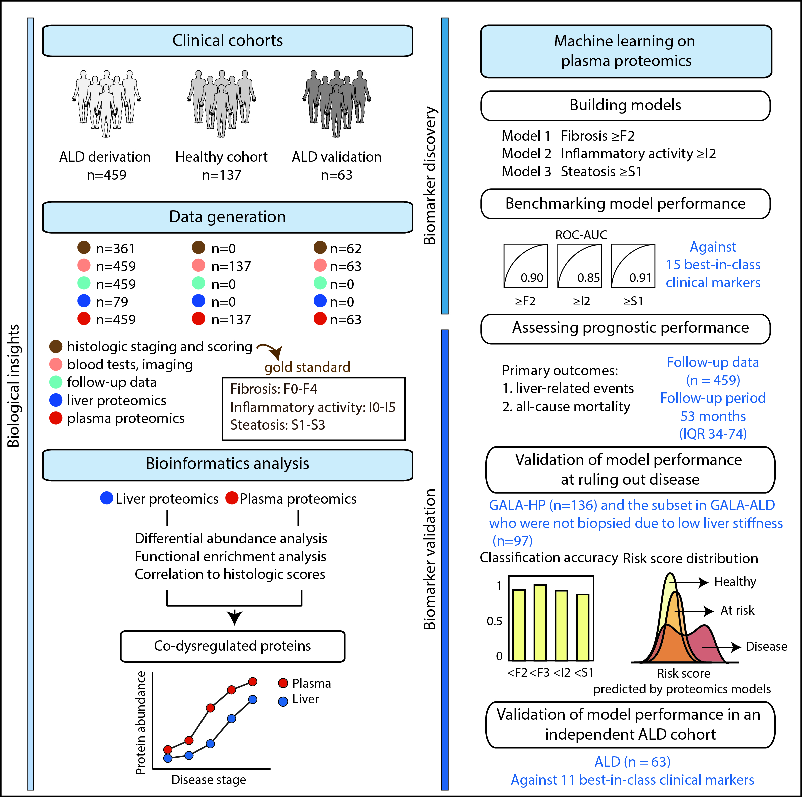

# Alcohol Related Liver Disease (ALD) project
- Link to repository: [github.com/llniu/ALD-study](https://github.com/llniu/ALD-study)
- Link to nature medicine artickle: [Noninvasive proteomic biomarkers for alcohol-related liver disease](https://doi.org/10.1038/s41591-022-01850-y)
- summary of scripts used for diverse analysis in the project
- 459 ALD patients (to varying degrees) and 137 age-, bmi-, and gender matched healthy controls in the discovery cohort
- 63 ALD patients in the validation cohort
- Datasets generated and used in this study include proteomics, clinical data (baseline and follow-up), and liver histology characterization.

## Contents

file                      | description
------------------------- | --------------------------------------
[ALD_ML](ALD-ML/ALD_ML.ipynb)    | Contains data pre-processing, Feature Selection,   Cross-Validation runs, Final model calculation and diverse   plots. Some functionality is loaded from [`src`](ALD-ML/src)
[ALD_ML_STATA](ALD-ML/ALD_ML_STATA.ipynb) | References to STATA `.do` files in main folder. Done in hospital on follow-up data.
[ALD_PA](ALD-PA/ALD_PA.ipynb)    | Contains Proteomics and Clinical data pre-processing, ANCOVA, Partial correlation, Integration between the liver- and plasma proteomes, and plots.
[ALD_App](ALD-App/ALD_app.py)     | Contains interactive data visualization Dash App.

## Nature Medicine article

> Niu, L., Thiele, M., Geyer, Philipp E., Rasmussen, D. N., Webel, H. E., Santos, A.,
> Gupta, R., Meier, F., Strauss, M., Kjaergaard, M., Lindvig, K., Jocobson, S.,
> Rasmussen, S., Hansen, T., Krag, A., & Mann, M. (2021).
> Noninvasive proteomic biomarkers for alcohol-related liver disease
> Nat Med 28, 1277–1287 (2022). https://doi.org/10.1038/s41591-022-01850-y

## Disclaimer

Summary data needed for the Dash app is open-access. The complete plasma proteomics data and clinical data are available from the authors upon reasonable request due to the need to maintain patient confidentiality.

## Summary of the study

